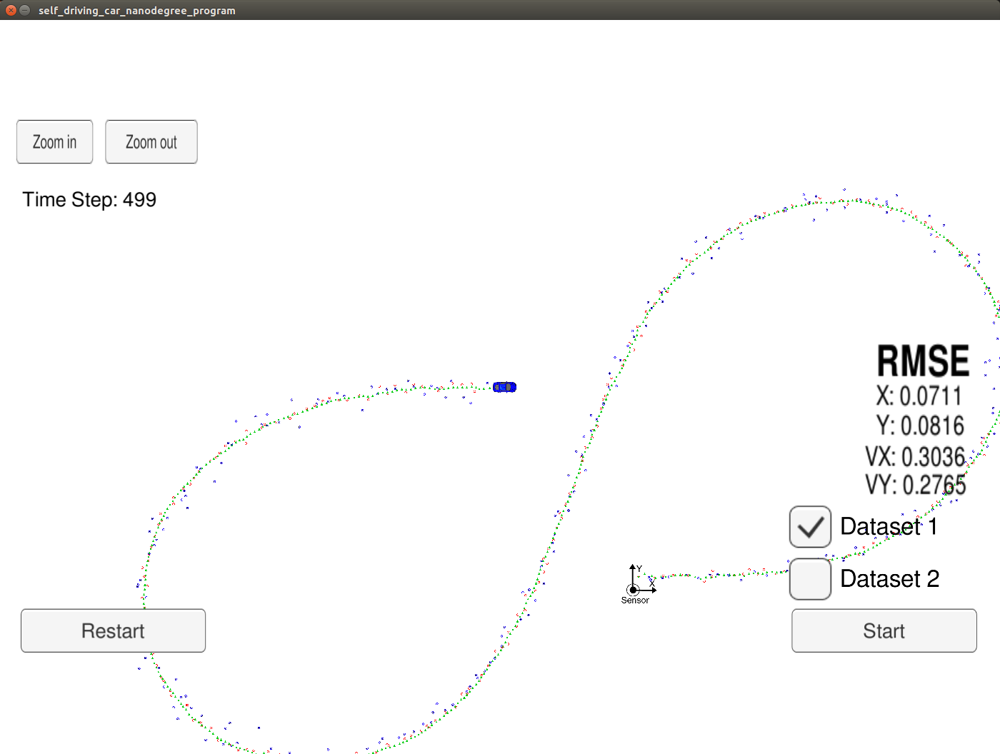

# Selfdriving car Nanodegree - Term2
## Project 2: Unscented Kalman Filter

In this project, an Unscented Kalman Filter (UKF) for sensor fusion is implemented in C++. The starter code was forked from the udacity repository: https://github.com/udacity/CarND-Extended-Kalman-Filter-Project

The algorithm written here is able to estimate the position and speed of a vehicle from noisy sensor measurements. In this particular project, a LIDAR and Radar data are simulated. The data of both sensors is combined using sensor fusion, also implemented into the UKF algorithm. The UKF algorithm is able to manage the non-linearities better than the Extended Kalman Filter. This will be checked with the simulation results. The algorithm was tested with the Udacity simulator, which can be found [here](https://github.com/udacity/self-driving-car-sim/releases). For running compiling and running the code, [uWebSocketIO](https://github.com/uWebSockets/uWebSockets) is also necessary.

For running the code in Linux, you just  need the following instructions in the command  line:

1. mkdir build
2. cd build
3. cmake ..
4. make
5. ./UnscentedKF

## Results of the simulation
The simulations using the  udacity simulator can be found below. The RMSE values are below the required values.

## Unscented vs Extended Kalman filter
The UKF was designed to take into account the non-linearities of dynamic systems. The EKF only linearizes these non-linearities around the working point of operation. For this reason, it is expected a higher precision from the UKF. However, this comes at a higher computational cost, as a result from multiple calculations that need to be done (sigma points).

The RMSE values from the UKF and the EKF filter are shown in the next table, for comparison.

| Parameters    | UKF (Radar only) | UKF (Lidar only) | UKF (fusion) | EKF (fusion) |
| ------------- |:----------------:|:----------------:|:------------:|-------------:|
| X             | 0.1496 	   | 0.0983           | 0.0620       | 0.0973       |
| Y             | 0.2020           | 0.0958           | 0.0816       | 0.0855       |
| Vx            | 0.3439           | 0.4281           | 0.2821       | 0.4513       |
| Vy            | 0.3751           | 0.2630           | 0.2727       | 0.4399       |

As can be seen, the UKF RMSE are lower than the EKF. Even the UKF using only the LIDAR sensor is lower than the sensor fusion with the EKF, which demonstrate the superior capabilities of the UKF filter. However, in some applications which doesn't require high precision, or are have limited CPU capabilities, may opt for the EKF algorithm, which is simpler and lighter to implement.
